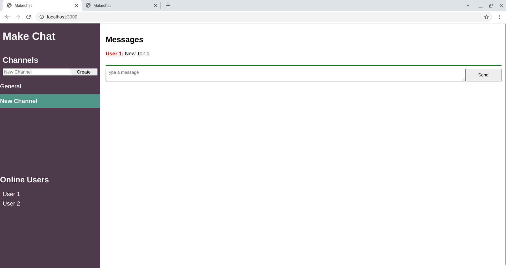

<h1 align="center">Make Chat</h1>

   Tutorial from  <a href="https://makeschool.org/mediabook/oa/tutorials/make-chat/start-slacking/" target="_blank">makeschool.org</a>.

## Table of Contents

- [Overview](#overview)
  - [Built With](#built-with)
- [Features](#features)
- [Improvements](#improvements)
- [Useful Resources](#useful-resources)

## Overview

MakeSchool was a coding bootcamp that went under.  Most content was made free and I found this and decided to follow along.

To run, git clone.

### Built With

- Express
- Express-Handlebars
- Socket.io

## Features

Chat App that persists users and channels.    

## Improvements

- Convert to vanilla from jquery
- Styling fixes - responsive
- Logout button
- Private Messaging

### Resources

- [Google](https://developers.google.com/speed/libraries#jquery) - jquery
- [CDNJS](https://cdnjs.com/libraries/flexboxgrid) - flexboxgrid
- [NPM](https://www.npmjs.com/package/express-handlebars) - express handlebars